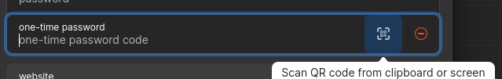
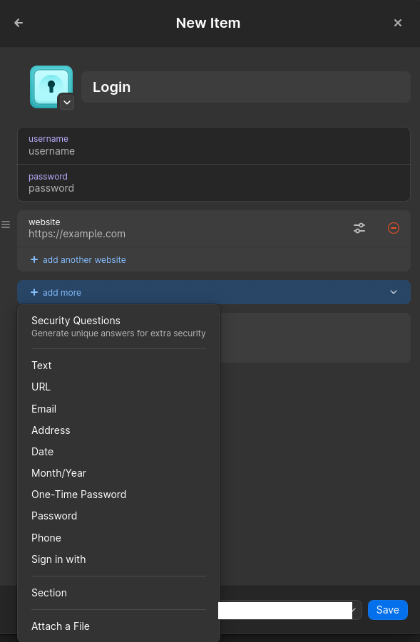
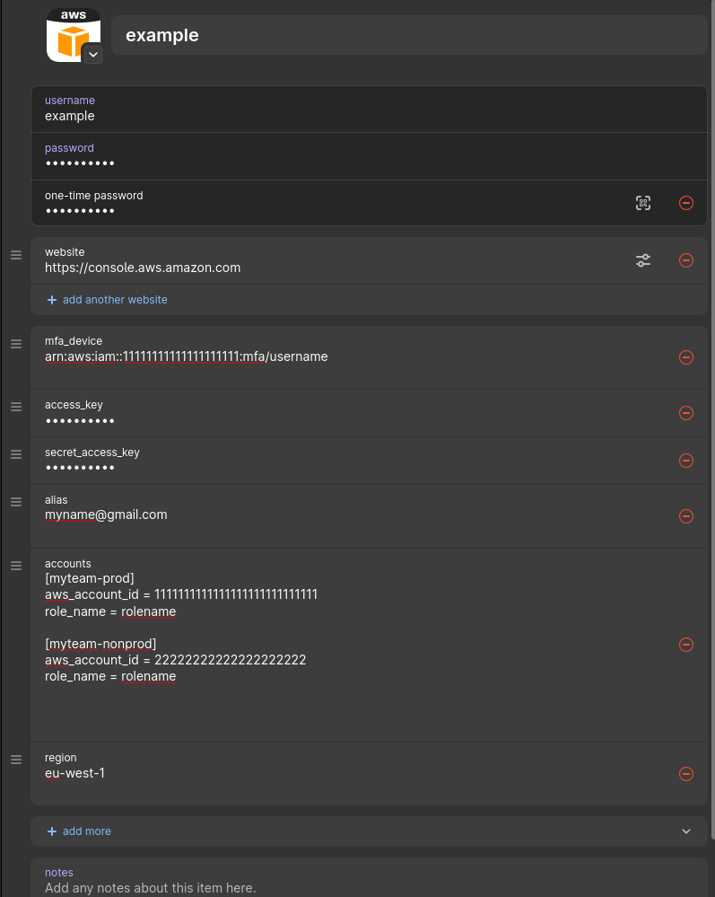

# 1Password connect settings

## Step to start using

### Have account list generated
you should generate similar list of your accounts as example in 
[accountList file](sampleFiles/accountList.md).This will be used similarly to AWS "Extend Switch Roles" chrome plugin where we switch between accounts. Basic syntax is the same with said chrome plugin

### Set up 

#### Set up AWS login to 1Password
if you already have set AWS login to 1password with mfa, you can skip this whole step.

Add AWS login to your 1Password. Basically create new login with your AWS username, password  and set website to be console.aws.amazon.com. This should change default login icon to AWS icon. 

Then go to process of adding MFA  [AWS MFA instruction video](https://pages.awscloud.com/how-to-enable-multi-factor-authentication-for-aws-account.html?nc1=f_ls)

instead of reading QR code with your phone, use 1password to read QR code: From 1password desktop app you can achieve this by pressing "add more" and picking one time password.
This creates field with QR code image. When you click qr-code image it should read QR images currently visible on your screen.

#### Set up fields for AWSRoleSwitcher

Now we need to add some fields to our 1password aws login that will be read from this app.

These field options can be found under add more option

Add following text fields:

* mfa_device : with arn of your MFA device
* alias: name that will be shown when you interact with the role. I recommend something that makes identifying you easier.
* region: Set default region like eu-west-1
* accounts: copy your accountList file here. It will be fetched to tool when you connect via 1password connect.

Then set following as "password" so others wont be able to read it from your screen.
* access_key
* secret_access_key
and copy your aws accesskey and secret accesskey values to them.
Now your setup should be completed. 

I would recomend removing accountlist file from local pc as well as accesskeys. They should be stored in 1password for now on.

### Connecting with 1password

Open add, select "connect" and "Connect via 1password". Note that you have to have 1password cliv2 installed as it will be used to issue commands towards 1password. You should have logged in with it at least once to provide MFA. If you don't have organizational account your domain is "my", otherwise domain is that has been assigned to your company. AWS login item name is name of entry in your 1password. Basically  1password Password is your password for 1password. These items allows app to issue command and request items content from 1password. 

Now you do not have to have configurations on your local device to be able to connect your AWS accounts and only required short time credentials are stored to credential file. This means that as long as you have required apps installed, you can switch PC:s easily. In addition, accesskey rotation is enabled by the app.

## Note worthy things
Technically speaking, you don't need username & password anymore. So, you can disable console access if you only plan to use this app for logging to AWS console. In reality it is always nice to have failsafe if your accesskeys stop working, but in some organizations someone might complain if you have console access that is not used. Method which this app opens console access to browser is counted as CLI access.