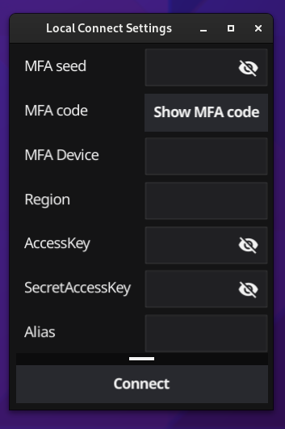

# Locally stored credentials usage

## Why
This is mainly intended for evaluating this tool, as local secrets are stored in unencrypted file, which lessens intended effectiveness of MFA.

## Step to start using

### Have account list generated
There is example in this folder that contains accountList file where name in square backets will be name of the account, id aws account id and role, the name of the role that can be assumed in said account. This file should be stored in your aws folder where aws cli saves credentials file. This should be home/<username>/.aws folder (which might be hidden)

###  Set up MFA
We require people to use MFA with AWS when using this tool, so you have to get secret seed that can be used to generate MFA tokens. QR Code Reader chrome extension is one option, but feel free to check other alternatives. Follow aws console instructions to point when you have to read QR code with your authenticator device. Instead of using mobile app, use QR code reader and copy code between secret=  and end it with & character. This is called "seed" from now on. Now go to app. select "connect" and  connect via local settings. Add seed you copied from QR code to MFA seed field. Select Show MFA code. This should show you your MFA code that you need to input on AWS console. Wait until code changes to get second token as two are needed. You can use copy button function, so you don't have to manually write token down. After this is done. Please also copy your MFA device id from same AWS console page to MFA Device field.

Note that you can click eye icon if you want to see what you pasted

### Rest of the settings

You should then copy your accesskey and secretaccess keys and default region you want to use. Also add meaningful alias, as it helps other people to see who is actually performing actions with out going too deep into cloudtrail logs. I personally use my email address. 

### Save settings
You have to press connect which also saves settings. Then you should be done and be able to list accounts and connect to them