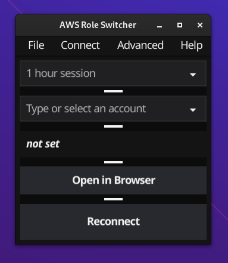
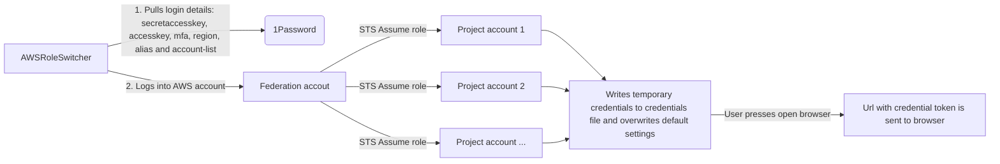

# AWSRoleSwitcher



###### Disclaimer

Note that AWSRoleSwitcher has no association with Amazon Web Services or Amazon in general. Name contains AWS to define which cloud provider this tool works with.

## Purpose
### Why
My main goal was to make one tool for AWS CLI and AWS Web Console access and make it as simple as possible. Main problem I had was that I was working for client whose AWS account count was +100. At that point having to write whole account name becomes bit of a memory excesice with tools I could find. With this tool I can name accounts in a way that tool helps me to filter what i need and often I only need to remember something like team name to figure out which account I need to access.

## What type of AWS setup you need
App expects
* Users to authenticate via AWS account, NOT via SSO/identity center
* Users to use MFA to log into AWS account
* Users assume role from their AWS account to other AWS account
* User in federation account has to have privileges set for assuming role and target project account's role has to have trust relation with federation account 
* Operations to rotate access keys, this includes listing users keys as we want to be sure we can create accesskey before starting operation. 

## Requirments for this app
* 1Password CLI tool (and user has to have logged in via 1password cli at least once to set up 1password MFA)
* 1Password desktop app (this is also handy for making CLI ask 1password password again after defined period of time)
* Golang **
* AWS CLI
* Fyne components https://developer.fyne.io/started/ (UI framework used in this project) Note that it is recommended to restart after installig these packages, or at least for me they only started working after restart. ***
* Linux/Mac****


** Is not required if you download binary file from release page
*** On Mac only required if you build your self, on Linux you might need opengl packages mentioned in documentation
**** Actively only tested with (Fedora & Mint) Linux. Since I don't own a mac, I can't really say for sure if it works, but I would imagine it works similarly to linux version as tool uses 1Password cli via bash  which should work same way in Mac and Linux. Fyne it self works on Windows, Linux, Mac, but bash commands used to call 1password cli have not been translated to Powershell commands which is requirement for it to work on windows. 


## Installation

### Easiest option
Just download release file for your operating system from github. There should be files for Linux and Mac operating systems. On Linux side you have to set execution permissions to file. From terminal this can be done with:
```bash
chmod +x awsroleswitcher
```
Most operating systems support this functionality from right clicking file, but steps are different between desktop environments and won't be defined here


### Using golang
We do expect that you have already installed required packages & tools and you are running supported OS. These are mentioned in "Requirements for this app" chapter 

#### Download code


get files by either download package and extract or use git clone to pull project (requires git to be installed)

```bash
git clone https://github.com/oappi/AWSRoleSwitcher.git
```

### Go installation (installation alternative 1) 
with goland & fyne components installed you can just build project with following command 
```bash
go build .
```

if this fails
* look at installation requirements and make sure you have all required packages installed

### Fyne-cross installation (installation alternative 2)
If you are having trouble with graphical libraries even after restart you might want to try following project that builds project inside docker container.   [fyne-cross](https://github.com/fyne-io/fyne-cross)

### Quick description of setup

We call AWS account users sign in a "federation account" and rest of the accounts project accounts but they are just normal AWS accounts with different function.




Since 1.1.0, settings stored in 1password can be saved locally in plain text file. Not recomended option, but option is there.

# Connection setup instructions
Currently tool supports both 1Password and local storing of credentials. I recommend you <strong>use 1Password as storing credentials locally to unencrypted files is not safest thing to do</strong>. If you don't want to use external credential providers that are supported (at the moment only 1password) I would suggest you try something  like aws-vault instead

[1Password Credential Setup](Docs/1passwordHowto.md)

[Local Credential Setup](Docs/localHowTo.md) <strong> meant for evaluation purposes only</strong>


## How to use it
You connect to credential provider like 1password or localcredentials. For 1password you save your credentials in 1password and this app will use 1password cli tool to fetch them, including MFA. 

### Session time
After you have "connected" to your credential provider you can pick session length. Default is one hour after which cli and browser session will expire. You can create new session with reconnect button. Also note that application does not create new session when you select session duration. 
#### Why session time does not connect automatically
This seemed most intuitive way to implement this after considering this case: I wanted to connect to another account, but I want longer session to that account. If tool would automatically connected after setting session time it would connect to old account and then I could select new account.

### Select account
When you want to switch AWS account: click second dropdown, pick what ever account you want to assume. Note that you can write on this field to filter accounts by name, id or assumed role name. example: account name is testin-account-3. you can just write 3 and it will match to testing-account-3. Immediately when you click account name it will sign into account.

###  AWS CLI usage
We overwrite default entry in users aws credential file so you don't have to define profile in your commands. You can use AWS CLI as you would normally with out specifying profile name. We expect credential file to exists when you start using this app.

### Open AWS console in browser
"open browser button" opens AWS console in your last interacted browser. This also allows you to sign in with multiple chrome profiles to different accounts or with totally different browsers. This feature works in a way that we create token with AWS credentials that we submit them to browser along with url

### Reconnect
Tool does not automatically reconnect user after token has expired and this is more of a feature. User should pick session time based on how long he plans to use account and after that it is invalid. With this logic user can force password query from 1password when creating new session.

### Rotate accesskeys
It is recommended to rotate accesskeys every now and then. This is under advance settings. You should only use it if you have 1 accesskey enabled for your user as AWS limits number of accesskeys per user. This basically creates new accesskeys, stores them in 1password.
